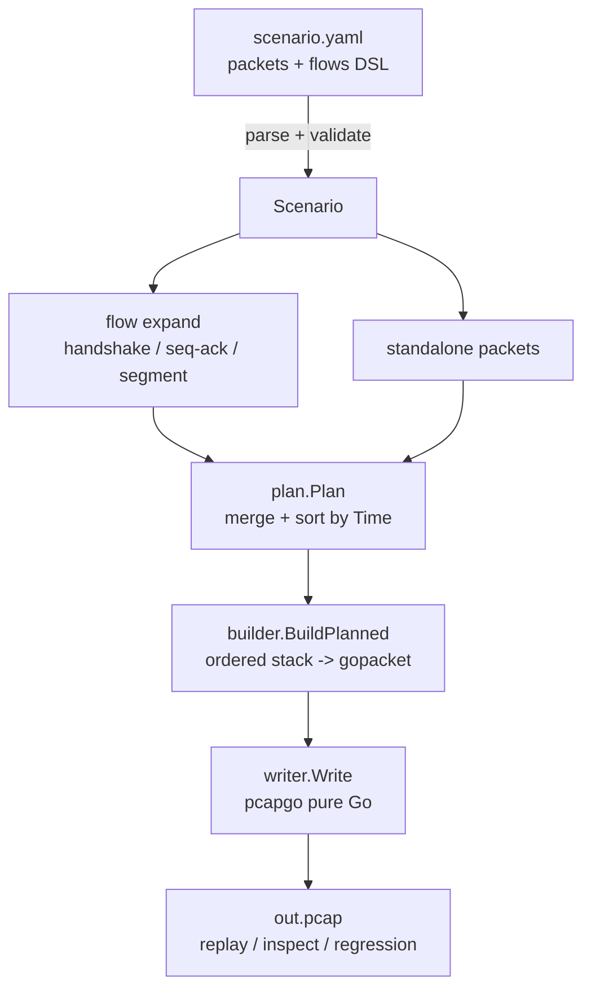

<h1 align="center">pMaker</h1>

<p align="center">
  
</p>

<p align="center">
  Build reproducible offline traffic samples with declarative YAML 
  <br>
  make test traffic as readable, reviewable, and regression-friendly as code.
</p>

<p align="center">
  
  
  
  
  
</p>

---

> **中文版**：见 [`README.md`](README.md)。

## What is pMaker?

**pMaker is an offline pcap constructor: describe protocol stacks and session
behavior in YAML, output deterministic `.pcap` files.**

It does not capture, send, or open raw sockets. Instead, it turns "ad-hoc traffic
crafting" into test assets that live in your repository — readable, reviewable,
and regression-friendly.

## Key Features

| Feature | Description |
|---------|-------------|
| **Declarative YAML** | Describe packets/flows as code; reviewable & diff-able |
| **Arbitrary layer nesting** | QinQ, GRE tunnels, recursive encapsulation — no fixed L2/L3/L4 slots |
| **Stateful TCP flows** | Auto handshake, seq/ack derivation, MSS segmentation, FIN/RST teardown |
| **Malformed & evasion** | Per-field `checksum`/`length` overrides, `payload_hex` raw injection, broken next-proto chains |
| **Deterministic output** | Same scenario → byte-identical pcap |
| **Pure Go** | Static cross-platform binary via `pcapgo` |
| **MCP server** | Expose generate/validate as Model Context Protocol tools for LLM agents |

## Protocol Coverage

| Layer | Protocols | Notes |
|-------|-----------|-------|
| L2 | `eth`, `vlan` | TPID/EtherType per-layer override |
| L3 | `ipv4`, `ipv6`, `gre`, `vxlan` | next-proto auto-derivation + override; `vxlan` is a UDP-encapsulated L2 tunnel (`udp(4789) → vxlan → eth`), supported per packet and in single-VXLAN TCP flows |
| L4 | `tcp`, `udp` | checksum binds to nearest IP |
| Control | `icmp`, `icmpv6` | echo + error messages |
| Application | `dns`, `http`, `ftp`, `smtp`, `pop3`, `telnet` | structured fields |
| Fallback | `payload`, `payload_hex` | raw bytes for malformations |

## Quick Start

### Build

```bash
CGO_ENABLED=0 go build -o bin/pmaker ./cmd/pmaker
```

### Generate a pcap

```bash
./bin/pmaker gen -f examples/http/get.yaml -o out.pcap
```

### Validate a scenario

```bash
./bin/pmaker validate -f examples/tunnel/qinq_gre.yaml
```

## Core Concepts

### Ordered Layer Stack

A pMaker packet is a `stack` ordered **outer-to-inner**. Layer types may repeat
(QinQ) and nest recursively (GRE tunnel inside GRE tunnel).

```yaml
packets:
  - stack:
      - eth:  { src: "00:11:22:33:44:55", dst: "66:77:88:99:aa:bb" }
      - ipv4: { src: "10.0.0.10", dst: "10.0.0.80", ttl: 64 }
      - tcp:  { sport: 40000, dport: 80, flags: [SYN], seq: 1000 }
```

```text
eth / ipv4 / tcp
eth / vlan / vlan / ipv4 / tcp      # QinQ
eth / ipv4 / gre / ipv4 / tcp       # GRE tunnel
eth / ipv4 / udp(4789) / vxlan / eth / ipv4 / tcp   # VXLAN tunnel
eth / ipv4 / udp / dns
eth / ipv4 / icmp
```

next-proto / EtherType / checksum pseudo-header are auto-derived by default. To
test "parse-chain break" or "non-standard encapsulation", override per layer
(e.g. `- vlan: { vid: 100, type: 0xffff }`).

### Stateful Flows

Instead of writing each packet's stack by hand, describe a stateful TCP flow.
The expander auto-maintains handshake, seq/ack, MSS segmentation, and teardown.
A `flow.stack` may also contain one complete VXLAN tunnel; reverse packets swap both
outer and inner endpoints while preserving VNI and outer UDP ports:

```yaml
flows:
  - name: http-flow
    stack:
      - eth:  { src: "00:00:00:00:00:01", dst: "00:00:00:00:00:02" }
      - ipv4: { src: "10.0.0.10", dst: "10.0.0.80", ttl: 64 }
      - tcp:  { sport: 49152, dport: 80, client_isn: 1000, server_isn: 5000, mss: 1460 }
      - tcp_session: { open: handshake, close: fin }
    messages:
      - from: src
        stack:
          - http_request: { method: GET, url: /index.html }
      - from: dst
        stack:
          - http_response: { status: 200, body: "Hello from pMaker" }
```

```text
client                                              server
  │ ─────────────── SYN ──────────────────────────▶ │
  │ ◀──────────── SYN,ACK ───────────────────────── │
  │ ─────────────── ACK ──────────────────────────▶ │
  │ ───────── HTTP request ───────────────────────▶ │
  │ ◀──────── HTTP response ─────────────────────── │
  │ ───────────── FIN/ACK ... ────────────────────▶ │
```

### Deterministic Timing

- Timing is optional: `base_time` (ISO8601 / UTC absolute anchor) + non-negative
  `offset_time` at each level. Unspecified → 1 ms per packet in order.
- Same scenario → byte-identical pcap.

Full field definitions live in [`internal/scenario`](internal/scenario) types and
[`examples/`](examples).

## Pipeline



## MCP Server

Besides the CLI, pMaker ships an **MCP server** that exposes "validate scenario /
generate pcap" as [Model Context Protocol](https://modelcontextprotocol.io) tools,
callable from any MCP-aware client (LLM IDEs / agents). This lets an LLM write
scenario YAML → validate → generate pcap → get structured feedback and self-correct
in a closed loop.

### Build

```bash
CGO_ENABLED=0 go build -o bin/pmaker-mcp ./cmd/pmaker-mcp
```

### Run

```bash
./bin/pmaker-mcp -workdir <scenario-workdir>
# or env var PMAKER_WORKDIR (default = current working directory)
```

### Tools

| Tool | Purpose |
|------|---------|
| `generate_yaml` | Validate scenario YAML; persist to `workdir/yaml/` on success. |
| `generate_pcap` | Validate YAML and generate pcap to `workdir/pcap/`; archive the YAML alongside. |

### Resources

| Resource | Purpose |
|----------|---------|
| `pmaker://schema` | Syntax overview |
| `pmaker://schema/{layer}` | Per-layer field reference |
| `pmaker://examples` | Example catalog (dynamic scan) |
| `pmaker://examples/{protocol}/{name}` | A single example YAML, verbatim |

### Client config example (Claude Code)

```jsonc
{
  "mcpServers": {
    "pmaker": {
      "command": "/path/to/bin/pmaker-mcp",
      "args": ["-workdir", "/path/to/scenarios"]
    }
  }
}
```

## Testing

```bash
go test ./...
go test ./internal/golden -run TestExamplesGolden -update   # regenerate golden pcaps
```

## License

[MIT](LICENSE) © Epicccal
