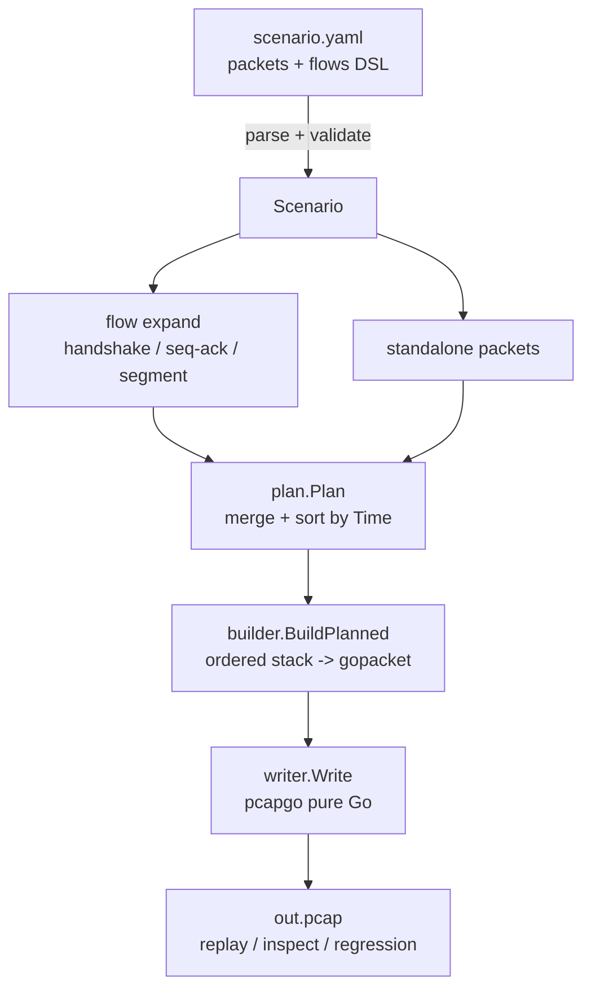

<h1 align="center">pMaker</h1>

<p align="center">
  
</p>

<p align="center">
  <strong> Generate Pcap Easier Again</strong>
</p>

<p align="center">
  用声明式 YAML 构造可复现的离线流量样本，让测试流量像代码一样可读、可审、可回归。
</p>

<p align="center">
  
  
  
  
  
</p>

---

> **English version**: see [`README.en.md`](README.en.md).

## pMaker 是什么？

**pMaker 是一个离线 pcap 构造器：用 YAML 描述协议栈和会话行为，输出确定性的 `.pcap` 文件。**

它不抓包、不发包、不打开 raw socket，而是把"临时造流量"变成可以沉淀在仓库里的测试资产——可读、可审、可回归。

## 核心特性

| 特性 | 说明 |
|------|------|
| **声明式 YAML** | 以代码形式描述包/流，可审阅、可 diff |
| **任意层栈嵌套** | QinQ、GRE 隧道、递归封装——无固定 L2/L3/L4 槽位 |
| **有状态 TCP 流** | 自动握手、seq/ack 推导、MSS 分段、FIN/RST 挥手 |
| **畸形与逃逸** | 逐层 `checksum`/`length` 覆盖、`payload_hex` 原始字节注入、断链 next-proto |
| **确定性输出** | 同一 scenario + seed → 逐字节相同的 pcap  |
| **纯 Go 实现** | 通过 `pcapgo` 生成静态跨平台二进制 |
| **MCP server** | 将生成/校验暴露为 Model Context Protocol 工具，供 LLM agent 调用 |

## 协议覆盖

| 层 | 协议 | 说明 |
|----|------|------|
| L2 | `eth`、`vlan` | 逐层覆盖 TPID/EtherType |
| L3 | `ipv4`、`ipv6`、`gre`、`vxlan` | next-proto 自动推导 + 覆盖;`vxlan` 为 UDP 承载二层隧道(`udp(4789) → vxlan → eth`),支持逐包构造与单层 VXLAN TCP flow |
| L4 | `tcp`、`udp` | checksum 绑定最近一层 IP |
| 控制层 | `icmp`、`icmpv6` | echo + 错误报文 |
| 应用层 | `dns`、`http`、`ftp`、`smtp`、`pop3`、`imap`、`telnet`、`eml_data` | 结构化字段 + 原始回退；`eml_data` 为协议无关 RFC 5322 内容层，SMTP DATA / POP3 RETR / IMAP FETCH literal 共用 |
| 保底字段 | `payload`、`payload_hex` | 用于畸形的原始字节 |

## 快速开始

### 构建

```bash
CGO_ENABLED=0 go build -o bin/pmaker ./cmd/pmaker
```

### 生成 pcap

```bash
./bin/pmaker gen -f examples/http/get.yaml -o out.pcap
```

### 校验场景

```bash
./bin/pmaker validate -f examples/tunnel/qinq_gre.yaml
```

## 核心概念

### 有序层栈

pMaker 的 packet 是一个从**外到内**排列的 `stack`。层类型可重复（QinQ）也可递归嵌套（GRE 隧道套 GRE 隧道）。

```yaml
packets:
  - stack:
      - eth:  { src: "00:11:22:33:44:55", dst: "66:77:88:99:aa:bb" }
      - ipv4: { src: "10.0.0.10", dst: "10.0.0.80", ttl: 64 }
      - tcp:  { sport: 40000, dport: 80, flags: [SYN], seq: 1000 }
```

```text
eth / ipv4 / tcp
eth / vlan / vlan / ipv4 / tcp      # QinQ
eth / ipv4 / gre / ipv4 / tcp       # GRE 隧道
eth / ipv4 / udp(4789) / vxlan / eth / ipv4 / tcp   # VXLAN 隧道
eth / ipv4 / udp / dns
eth / ipv4 / icmp
```

next-proto / EtherType / checksum 伪首部默认自动推导。测试"解析断链"或"非标封装"时可逐层覆盖（如 `- vlan: { vid: 100, type: 0xffff }`）。

### 有状态流

不必逐包手写 stack，而是描述一条有状态 TCP 流。展开器自动维护握手、seq/ack、MSS 分段与挥手。`flow.stack` 也可写一层 VXLAN 完整隧道栈；反向包同时交换内外层端点，VNI 与 outer UDP 端口保持声明值：

```yaml
flows:
  - name: http-flow
    stack:
      - eth:  { src: "00:00:00:00:00:01", dst: "00:00:00:00:00:02" }
      - ipv4: { src: "10.0.0.10", dst: "10.0.0.80", ttl: 64 }
      - tcp:  { sport: 49152, dport: 80, client_isn: 1000, server_isn: 5000, mss: 1460 }
      - tcp_session: { open: handshake, close: fin }
    messages:
      - from: src
        stack:
          - http_request: { method: GET, url: /index.html }
      - from: dst
        stack:
          - http_response: { status: 200, body: "Hello from pMaker" }
```

```text
client                                              server
  │ ─────────────── SYN ──────────────────────────▶ │
  │ ◀──────────── SYN,ACK ───────────────────────── │
  │ ─────────────── ACK ──────────────────────────▶ │
  │ ───────── HTTP request ───────────────────────▶ │
  │ ◀──────── HTTP response ─────────────────────── │
  │ ───────────── FIN/ACK ... ────────────────────▶ │
```

flow 内的 `vlan` 还可按方向取值：`src_vid` 用于上行（src→dst），`dst_vid` 用于下行；
单边缺省表示该方向整层摘除，由此表达「上行带标签下行不带」「上行双层 QinQ 下行单层」
（见 [`examples/tunnel/vlan_directional.yaml`](examples/tunnel/vlan_directional.yaml)）：

```yaml
      - vlan: { src_vid: 100, dst_vid: 500 }   # 外层：上行 100 / 下行 500
      - vlan: { src_vid: 200 }                 # 内层：仅上行有，下行摘除
```

### 确定性时序

- 时序可选：`base_time`（ISO8601 / UTC 绝对锚）+ 各级非负 `offset_time`。
- 未指定时序则每包按序 1ms 递增。
- 同一 scenario + 同一 seed → 逐字节相同的 pcap。

完整字段定义见 [`internal/scenario`](internal/scenario) 类型与 [`examples/`](examples)。

## 数据流



## MCP Server

除 CLI 外，pMaker 还内置一个 **MCP server**，把"校验场景 / 生成 pcap"暴露成 [Model Context Protocol](https://modelcontextprotocol.io) 工具，可供任意支持 MCP 的客户端（大模型 IDE / agent）调用。这让 LLM 能自己写场景 YAML → 校验 → 生成 pcap → 拿回结构化反馈并自我修正，形成闭环。

### 构建

```bash
CGO_ENABLED=0 go build -o bin/pmaker-mcp ./cmd/pmaker-mcp
```

### 启动

```bash
./bin/pmaker-mcp -workdir <场景工作目录>
# 或环境变量 PMAKER_WORKDIR（缺省 = 当前工作目录）
```

### 工具

| 工具 | 作用 |
|------|------|
| `generate_yaml` | 校验场景 YAML；通过则落盘到 `workdir/yaml/`。 |
| `generate_pcap` | 校验 YAML 并生成 pcap 到 `workdir/pcap/`，同时归档同名 YAML。 |

### 资源

| 资源 | 作用 |
|------|------|
| `pmaker://schema` | 语法总览 |
| `pmaker://schema/_conventions` | 全局通则（两态覆盖 / `@file` / Hex / 兜底 / 成帧），写任意场景前读一次 |
| `pmaker://schema/{layer}` | 单层字段速查 |
| `pmaker://examples` | 示例清单（动态扫描） |
| `pmaker://examples/{protocol}/{name}` | 单个示例 YAML 原文 |

### 客户端配置示例（Claude Code）

```jsonc
{
  "mcpServers": {
    "pmaker": {
      "command": "/path/to/bin/pmaker-mcp",
      "args": ["-workdir", "/path/to/scenarios"]
    }
  }
}
```

## 测试

```bash
go test ./...
go test ./internal/golden -run TestExamplesGolden -update   # 重生 golden pcap
```

## 许可证

[MIT](LICENSE) © Epicccal
