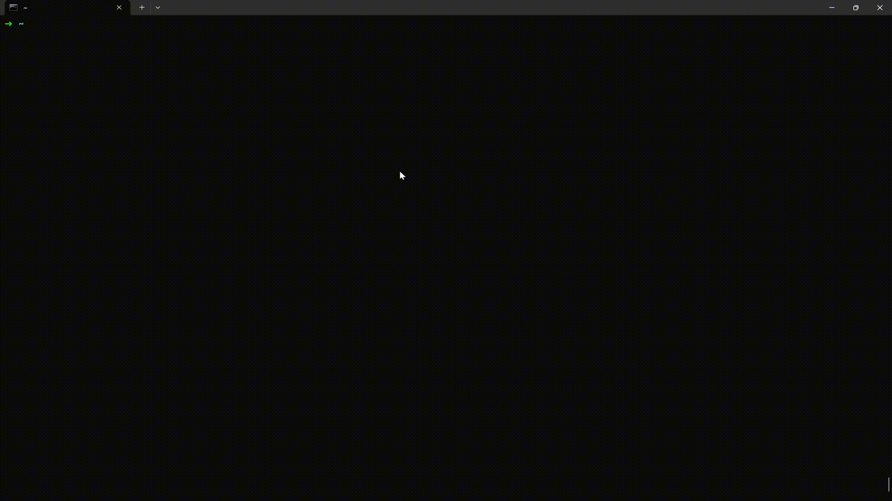

<p align="center">
  
  <a href="https://github.com/Epicccal/pMaker/actions/workflows/ci.yml"></a>
  <a href="https://goreportcard.com/report/github.com/Epicccal/pMaker"></a>
  <a href="LICENSE"></a>
</p>

<div align="center">
  <a href="https://github.com/Epicccal/pMaker">
    
  </a>

  <h1 align="center">pMaker</h1>

  <p align="center">
    <strong>Generate Pcap Easier Again</strong>
    <br />
    用声明式 YAML 构造可复现的离线流量样本，让测试流量像代码一样可读、可审、可回归。
    <br />
    <a href="examples"><strong>浏览示例场景 »</strong></a>
    <br />
    <br />
    <a href="cmd/pmaker-mcp/resources/schema">语法速查</a>
    &middot;
    <a href="https://github.com/Epicccal/pMaker/issues/new">报告 Bug</a>
    &middot;
    <a href="https://github.com/Epicccal/pMaker/issues/new">功能建议</a>
    &middot;
    <a href="README.en.md">English</a>
  </p>
</div>

## 关于 pMaker

**pMaker 是一个离线 pcap 构造器：用 YAML 描述协议栈和会话行为，输出确定性的 `.pcap` 文件。**

它把"临时造流量"变成可以沉淀在仓库里的测试资产。

```console
$ pmaker gen -f examples/http/get.yaml -o out.pcap
生成文件: out.pcap
Pcap组成:
[ 1] 2020-01-01T00:00:00.000000Z 10.0.0.10:49152 -> 10.0.0.80:80  eth/ipv4/tcp
[ 2] 2020-01-01T00:00:00.001000Z 10.0.0.10:49152 <- 10.0.0.80:80  eth/ipv4/tcp
[ 3] 2020-01-01T00:00:00.002000Z 10.0.0.10:49152 -> 10.0.0.80:80  eth/ipv4/tcp
[ 4] 2020-01-01T00:00:00.003000Z 10.0.0.10:49152 -> 10.0.0.80:80  eth/ipv4/tcp/http
[ 5] 2020-01-01T00:00:00.004000Z 10.0.0.10:49152 <- 10.0.0.80:80  eth/ipv4/tcp
[ 6] 2020-01-01T00:00:00.005000Z 10.0.0.10:49152 <- 10.0.0.80:80  eth/ipv4/tcp/http
...
已生成 11 个包
```

上面这条命令的输入，是一份完整的 HTTP GET 会话场景：

```yaml
link_type: ethernet
base_time: "2020-01-01T00:00:00Z"
flows:
  - name: http-get-200
    stack:   # flow 中 src = SYN 发起方，dst = SYN 接收方
      - eth:  { src: "00:11:22:33:44:55", dst: "66:77:88:99:aa:bb" }
      - ipv4: { src: "10.0.0.10", dst: "10.0.0.80", ttl: 64 }
      - tcp:  { sport: 49152, dport: 80, client_isn: 1000, server_isn: 5000 }
      - tcp_session: { open: handshake, close: fin }   # 握手与挥手自动展开
    messages:
      - from: src
        stack:
          - http_request: { method: GET, url: /index.html, headers: { Host: example.com } }
      - from: dst
        stack:
          - http_response: { status: 200, auto_content_length: true, body: "hello" }
```

seq/ack 推导、三次握手、四次挥手、对端 ACK 全部由 flow 展开器补全。

### 核心特性

| 特性 | 说明 |
|------|------|
| **声明式 YAML** | 以代码形式描述包/流，可审阅、可 diff |
| **任意层栈嵌套** | QinQ、GRE 递归封装——无固定 L2/L3/L4 槽位 |
| **流的状态维护** | 自动握手、seq/ack 推导、MSS 分段、FIN/RST 挥手 |
| **畸形与逃逸** | 逐层 `checksum`/`length` 覆盖、`payload`/`payload_hex` 原始字节注入、断链 next-proto |
| **确定性输出** | 同一 scenario → 逐字节相同的 pcap |
| **纯 Go 实现** | 通过 `pcapgo` 生成静态跨平台二进制 |
| **MCP server 集成** | 将校验与生成暴露为 MCP 工具，供 LLM agent 调用 |

### 其他功能

- next-proto 与 EtherType 自动推导，可逐层覆盖以制造解析断链
- TCP/UDP checksum 伪首部绑定就近 IP 层，多层 IP 时自动绑定内层
- 跨流依赖 start_after，锚定流与消息的时序关系
- 时间锚点 base_time 与 offset_time，锚定包与消息的时序关系
- HTTP Content-Length 自动补全
- HTTP Content-Encoding: gzip / deflate / deflate_raw / br / zstd / compress 编码
- HTTP Transfer-Encoding: chunked / gzip / deflate / deflate_raw / compress 编码
- ICMP echo/reply 与错误响应推导
- DNS Record: A / AAAA / CNAME / NS / PTR / MX / TXT / SOA / SRV 构造
- RFC 5322: Internet Message Format 构造
- RFC 2045: MIME Content-Transfer-Encoding 编码
- 文件占位符 @file(path): 基于 workdir 中的文件路径注入原始字节

字段级语义与设计取舍见 [CLAUDE.md](CLAUDE.md)。

### 协议覆盖

层名以 `internal/scenario/layer_decode.go` 为准，字段速查见 [schema 文档](cmd/pmaker-mcp/resources/schema)。

| 分层 | 层名 |
|------|------|
| L2 | `eth`、`vlan` |
| L3 | `ipv4`、`ipv6`、`gre`、`vxlan` |
| L4 | `tcp`、`udp`、`tcp_session` |
| 控制 | `icmp`、`icmpv6` |
| 应用 | `dns`、`http_request`、`http_response`、`ftp_request`、`ftp_response`、`telnet`、`smtp_request`、`smtp_response`、`pop3_request`、`pop3_response`、`imap_request`、`imap_response`、`eml_data` |
| 兜底 | `payload`、`payload_hex` |

## 快速开始

### 安装

- 直接安装

```sh
# 需要 Go 1.25+
go install github.com/Epicccal/pMaker/cmd/pmaker@latest
```

- 从源码构建（含 MCP server）：

```sh
git clone https://github.com/Epicccal/pMaker.git && cd pMaker
CGO_ENABLED=0 go build -o bin/pmaker ./cmd/pmaker
CGO_ENABLED=0 go build -o bin/pmaker-mcp ./cmd/pmaker-mcp
```

### CLI

```sh
pmaker gen -f examples/http/get.yaml -o out.pcap               # 生成 pcap
pmaker validate -f examples/tunnel/qinq_gre.yaml               # 只校验，不出包
pmaker version                                                 # 打印版本
```

### MCP Server



客户端配置示例（Claude Code）：

```sh
# sh
claude mcp add -s user pmaker -- /path/to/bin/pmaker-mcp -workdir /path/to/scenarios
```

or

```jsonc
// mcp.json
{
  "mcpServers": {
    "pmaker": {
      "command": "/path/to/bin/pmaker-mcp",
      "args": ["-workdir", "/path/to/scenarios"]
    }
  }
}
```

| 工具 | 作用 |
|------|------|
| `generate_yaml` | 校验场景 YAML；通过则落盘到 `workdir/yaml/` |
| `generate_pcap` | 校验 YAML 并生成 pcap 到 `workdir/pcap/`，同时归档同名 YAML |

| 资源 | 作用 |
|------|------|
| `pmaker://schema` | 语法总览 |
| `pmaker://schema/_conventions` | 全局通则（两态覆盖 / `@file` / Hex / 兜底 / 成帧），写任意场景前读一次 |
| `pmaker://schema/{layer}` | 单层字段速查 |
| `pmaker://examples` | 示例清单（动态扫描） |
| `pmaker://examples/{protocol}/{name}` | 单个示例 YAML 原文 |

## 贡献

欢迎 PR。提交前跑质量门禁 `make quality`（gofmt + vet + lint + test）。

新增协议的完整步骤（builder / scenario / examples / MCP schema / golden 测试）见 [CLAUDE.md](CLAUDE.md) 的"新增一个协议的步骤"一节：新协议须同时补一个规范用例与一个畸形用例，并生成 golden 基准。

设计约束、数据流与 flow 时间语义同样记在 [CLAUDE.md](CLAUDE.md)。

## 许可证

基于 MIT 许可证分发，详见 [LICENSE](LICENSE)。由 [@Epicccal](https://github.com/Epicccal) 维护。
